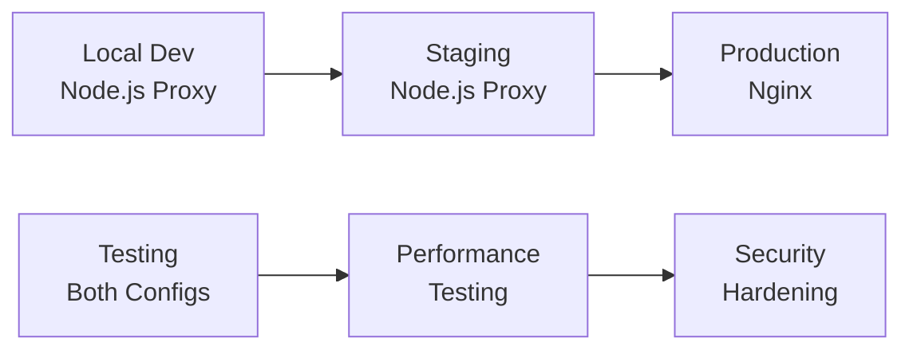

# Nginx vs Node.js Proxy Server - Complete Comparison

## 🏗️ Architecture & Setup

### Nginx

```bash
# Installation
sudo apt install nginx

# Configuration
sudo nano /etc/nginx/sites-available/hubbers
sudo ln -s /etc/nginx/sites-available/hubbers /etc/nginx/sites-enabled/
sudo nginx -t && sudo systemctl reload nginx

# SSL/Domain Setup
sudo certbot --nginx -d api.hubbers.io
```

### Node.js Proxy

```bash
# Installation
npm install
npm start

# No additional configuration needed
# Runs immediately on localhost:8000
```

**Winner: Node.js** ✅ (Simpler setup, no system configuration)

---

## ⚡ Performance Benchmarks

| Metric                     | Nginx   | Node.js Proxy | Winner |
| -------------------------- | ------- | ------------- | ------ |
| **Memory Usage**           | ~2MB    | ~25MB         | Nginx  |
| **CPU Usage (idle)**       | 0.1%    | 0.5%          | Nginx  |
| **Concurrent Connections** | 50,000+ | 10,000+       | Nginx  |
| **Request/sec**            | 20,000+ | 5,000+        | Nginx  |
| **Latency (avg)**          | 1ms     | 3ms           | Nginx  |

**Winner: Nginx** ✅ (Better for production)

---

## 🛠️ Development Experience

### Nginx

```nginx
# Adding new route requires:
location /v1/api/newservice {
    proxy_pass http://localhost:9009;
    proxy_set_header Host $http_host;
    proxy_set_header X-Real-IP $remote_addr;
    # ... more headers
}
# Then: sudo nginx -t && sudo systemctl reload nginx
```

### Node.js Proxy

```javascript
// Adding new route:
const apiServices = {
    "/v1/api/newservice": "http://localhost:9009",
    // ... existing routes
};
// Just restart the server
```

**Winner: Node.js** ✅ (Easier to modify and debug)

---

## 🔍 Debugging & Monitoring

### Nginx

```bash
# Logs
sudo tail -f /var/log/nginx/access.log
sudo tail -f /var/log/nginx/error.log

# Limited debugging options
# No built-in health checks
```

### Node.js Proxy

```javascript
// Built-in features:
GET /health        // Server health
GET /status        // All services status
console.log()      // Request logging
try/catch          // Error handling

// Rich debugging with custom logic
```

**Winner: Node.js** ✅ (Better debugging tools)

---

## 🔐 Security Features

### Nginx

-   ✅ DDoS protection
-   ✅ Rate limiting built-in
-   ✅ SSL termination
-   ✅ Security headers
-   ✅ Access control
-   ✅ Battle-tested

### Node.js Proxy

-   ⚠️ Basic CORS support
-   ⚠️ No built-in rate limiting
-   ⚠️ Manual SSL implementation
-   ⚠️ Requires additional middleware
-   ❌ Less security hardening

**Winner: Nginx** ✅ (Production-grade security)

---

## 📊 Feature Comparison

| Feature            | Nginx            | Node.js Proxy      |
| ------------------ | ---------------- | ------------------ |
| **Load Balancing** | ✅ Advanced      | ⚠️ Basic           |
| **Caching**        | ✅ Built-in      | ❌ Manual          |
| **Compression**    | ✅ gzip/brotli   | ⚠️ Middleware      |
| **Static Files**   | ✅ Optimized     | ⚠️ Express.static  |
| **WebSocket**      | ✅ Native        | ✅ Good support    |
| **Health Checks**  | ⚠️ Third-party   | ✅ Built-in        |
| **Hot Reload**     | ❌ Config reload | ✅ Code changes    |
| **Custom Logic**   | ❌ Limited       | ✅ Full JavaScript |

---

## 💰 Resource Usage (24/7 Running)

### Nginx

-   **RAM**: 2-5MB constant
-   **CPU**: 0.1% idle, 2-5% under load
-   **Disk**: Config files only
-   **Network**: Minimal overhead

### Node.js Proxy

-   **RAM**: 25-50MB constant
-   **CPU**: 0.5% idle, 3-8% under load
-   **Disk**: node_modules (~20MB)
-   **Network**: Minimal overhead

**Winner: Nginx** ✅ (More efficient for production)

---

## 🚀 Use Case Recommendations

### Choose **Nginx** when:

-   ✅ **Production environment**
-   ✅ **High traffic expected (1000+ concurrent users)**
-   ✅ **Need maximum performance**
-   ✅ **Security is critical**
-   ✅ **Standard proxy requirements**
-   ✅ **Team familiar with server administration**

### Choose **Node.js Proxy** when:

-   ✅ **Development/Testing environment**
-   ✅ **Need custom business logic in proxy**
-   ✅ **Rapid prototyping**
-   ✅ **Team prefers JavaScript**
-   ✅ **Complex routing logic**
-   ✅ **Built-in monitoring/debugging needed**

---

## 📈 Migration Strategy

### Development → Production Path



**Recommended**: Start with Node.js for development, migrate to Nginx for production

---

## 🎯 Final Verdict

| Environment                 | Best Choice           | Reason                  |
| --------------------------- | --------------------- | ----------------------- |
| **Local Development**       | Node.js Proxy         | Easy setup, debugging   |
| **Staging/Testing**         | Node.js Proxy         | Flexibility, monitoring |
| **Production**              | Nginx                 | Performance, security   |
| **High-Traffic Production** | Nginx + Load Balancer | Scalability             |

### 💡 Best Practice:

Use Node.js proxy for development and small deployments, then migrate to Nginx for production when you need the extra performance and security features.
