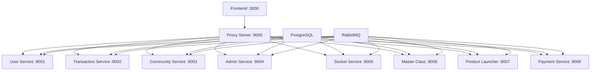

# Hubbers Proxy Server

A Node.js-based proxy server for the Hubbers microservices architecture that routes requests to appropriate backend services and handles WebSocket connections.

## 🏗️ Architecture Overview

The Hubbers platform consists of **9 microservices** plus the proxy server, all communicating through a centralized proxy layer.

```
Frontend (3000) → Proxy Server (9000) → Backend Services (9001-9008)
```

## 📋 Complete Services List

### **Core Infrastructure**

| Service          | Port   | Directory       | Status      | Description                          |
| ---------------- | ------ | --------------- | ----------- | ------------------------------------ |
| **Proxy Server** | `9000` | `proxy-server/` | ✅ Required | Central routing & WebSocket handling |
| **Frontend App** | `3000` | `front-end/`    | 🔄 Optional | React/Next.js user interface         |

### **Backend Microservices**

| Service                  | Port   | Directory               | Status      | Description                                |
| ------------------------ | ------ | ----------------------- | ----------- | ------------------------------------------ |
| **User Service**         | `9001` | `api-user/`             | ✅ Critical | Authentication, profiles, user management  |
| **Transaction Service**  | `9002` | `api-transaction/`      | ✅ Critical | Payment processing, financial transactions |
| **Community Service**    | `9003` | `api-community/`        | ✅ Required | Community features, groups, posts          |
| **Admin Service**        | `9004` | `api-admin/`            | ✅ Required | Admin panel, configurations, settings      |
| **Socket Service**       | `9005` | `api-socket/`           | ✅ Critical | Real-time messaging, notifications         |
| **Master Class Service** | `9006` | `api-master-class/`     | 🔄 Optional | Course management, educational content     |
| **Product Launcher**     | `9007` | `api-product-launcher/` | ✅ Required | Product management, marketplace            |
| **Payment Service**      | `9008` | `api-payment/`          | ✅ Critical | Payment gateway integration                |

### **Supporting Services**

| Service            | Port  | Directory     | Status      | Description                             |
| ------------------ | ----- | ------------- | ----------- | --------------------------------------- |
| **Mailer Service** | `N/A` | `api-mailer/` | 🔄 Optional | Email notifications (RabbitMQ consumer) |

## 🚀 Quick Start Guide

### **Prerequisites**

-   Node.js 18+ and Yarn
-   PostgreSQL database
-   RabbitMQ message broker

### **Start All Services**

You need to run these commands in **separate terminals**:

```bash
# Terminal 1 - Proxy Server (MUST BE FIRST)
cd proxy-server && yarn start

# Terminal 2 - User Service (Critical)
cd api-user && yarn start:dev

# Terminal 3 - Socket Service (Critical)
cd api-socket && yarn start:dev

# Terminal 4 - Transaction Service
cd api-transaction && yarn start:dev

# Terminal 5 - Community Service
cd api-community && yarn start:dev

# Terminal 6 - Admin Service
cd api-admin && yarn start:dev

# Terminal 7 - Product Launcher
cd api-product-launcher && yarn start:dev

# Terminal 8 - Payment Service
cd api-payment && yarn start:dev

# Terminal 9 - Master Class Service (Optional)
cd api-master-class && yarn start:dev

# Terminal 10 - Frontend (Optional)
cd front-end && yarn dev
```

## 🎯 Service Priority & Dependencies

### **Critical Services (Start First)**

1. **Proxy Server** (`9000`) - Must be running first
2. **User Service** (`9001`) - Authentication dependency
3. **Socket Service** (`9005`) - Real-time features
4. **Transaction Service** (`9002`) - Payment flows

### **Required Services**

5. **Community Service** (`9003`) - Core social features
6. **Admin Service** (`9004`) - Configuration management
7. **Product Launcher** (`9007`) - Core business logic
8. **Payment Service** (`9008`) - Financial operations

### **Optional Services**

9. **Master Class Service** (`9006`) - Educational features
10. **Frontend App** (`3000`) - User interface
11. **Mailer Service** - Background email processing

## 🔧 Environment Setup

### **Database & Message Queue**

```bash
# Start PostgreSQL
sudo systemctl start postgresql

# Start RabbitMQ
sudo systemctl start rabbitmq-server
```

### **Environment Variables**

Each service requires a `.env` file. Key variables:

```env
# Database
DB_HOST=localhost
DB_PORT=5432
DB_USER=your_db_user
DB_PASSWORD=your_db_password
DB_NAME=hubbers_db

# RabbitMQ
RABBITMQ_URL=amqp://localhost:5672

# Service Ports
SERVER_PORT=9001  # Different for each service
SERVER_HOST=localhost
```

## 📊 Service Health Check

### **Check Running Services**

```bash
# Check all ports at once
netstat -tlnp | grep -E ':(3000|9000|9001|9002|9003|9004|9005|9006|9007|9008)'

# Or use ss if netstat is not installed
ss -tlnp | grep -E ':(3000|9000|9001|9002|9003|9004|9005|9006|9007|9008)'
```

### **Proxy Health Endpoints**

```bash
# General health check
curl http://localhost:9000/health

# Service status check
curl http://localhost:9000/status
```

## 🌐 Service Routes

### **API Routes**

| Path Pattern             | Target Service       | Port |
| ------------------------ | -------------------- | ---- |
| `/v1/api/auth/*`         | User Service         | 9001 |
| `/v1/api/profile/*`      | User Service         | 9001 |
| `/v1/api/transaction/*`  | Transaction Service  | 9002 |
| `/v1/api/community/*`    | Community Service    | 9003 |
| `/v1/api/admin/*`        | Admin Service        | 9004 |
| `/v1/api/notification/*` | Socket Service       | 9005 |
| `/v1/api/conversation/*` | Socket Service       | 9005 |
| `/v1/api/course/*`       | Master Class Service | 9006 |
| `/v1/api/project/*`      | Product Launcher     | 9007 |
| `/v1/api/payment/*`      | Payment Service      | 9008 |

### **WebSocket Routes**

| Path           | Target Service | Port |
| -------------- | -------------- | ---- |
| `/socket.io/*` | Socket Service | 9005 |

### **Documentation Routes**

| Path              | Target Service    | Port |
| ----------------- | ----------------- | ---- |
| `/user/docs`      | User Service      | 9001 |
| `/community/docs` | Community Service | 9003 |
| `/socket/docs`    | Socket Service    | 9005 |
| `/admin/docs`     | Admin Service     | 9004 |

## 🔍 Troubleshooting

### **Common Issues**

#### **ECONNREFUSED Errors**

```
❌ Proxy error: connect ECONNREFUSED 127.0.0.1:9001
```

**Solution:** The target service is not running. Start the missing service.

#### **ECONNRESET Errors**

```
[HPM] ECONNRESET: Error: socket hang up
```

**Solution:** Service is running but crashing. Check service logs and restart.

#### **WebSocket Errors**

```
[HPM] WebSocket error: Error [ERR_STREAM_WRITE_AFTER_END]
```

**Solution:** Socket service connection issues. Restart socket service and proxy.

#### **Trust Proxy Errors**

```
ValidationError: The 'X-Forwarded-For' header is set but Express 'trust proxy' setting is false
```

**Solution:** Already fixed in socket service configuration.

### **Service Dependencies**



## 📝 Development Tips

### **Service Installation**

If a service fails to start due to missing dependencies:

```bash
cd api-[service-name]
yarn install
yarn start:dev
```

### **Database Setup**

```bash
# Create database for each service
createdb hubbers_user
createdb hubbers_community
createdb hubbers_admin
# ... etc
```

### **Monitoring**

```bash
# Monitor all service logs
tail -f proxy-server/logs/* api-*/logs/*

# Or use PM2 for process management
npm install -g pm2
pm2 start ecosystem.config.js
```

## 🔒 Production Deployment

For production, consider using:

-   **PM2** for process management
-   **Nginx** for better performance and SSL termination
-   **Docker** for containerization
-   **Load balancers** for high availability

## 📞 Support

-   **Health Check:** `GET http://localhost:9000/health`
-   **Service Status:** `GET http://localhost:9000/status`
-   **Documentation:** Each service has its own `/docs` endpoint

---

## Summary

**Total Services to Run:** **9-11 services**

-   **9 Required:** Proxy + 8 backend services
-   **2 Optional:** Frontend + Mailer service

**Minimum for Basic Functionality:** **5 services**

-   Proxy Server (9000)
-   User Service (9001)
-   Socket Service (9005)
-   Community Service (9003)
-   Admin Service (9004)

**Recommended for Full Functionality:** **9 services**

-   All backend services + proxy server
